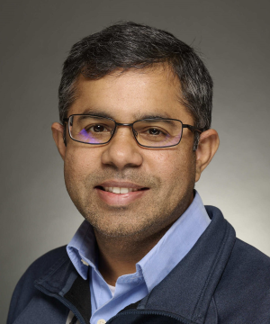
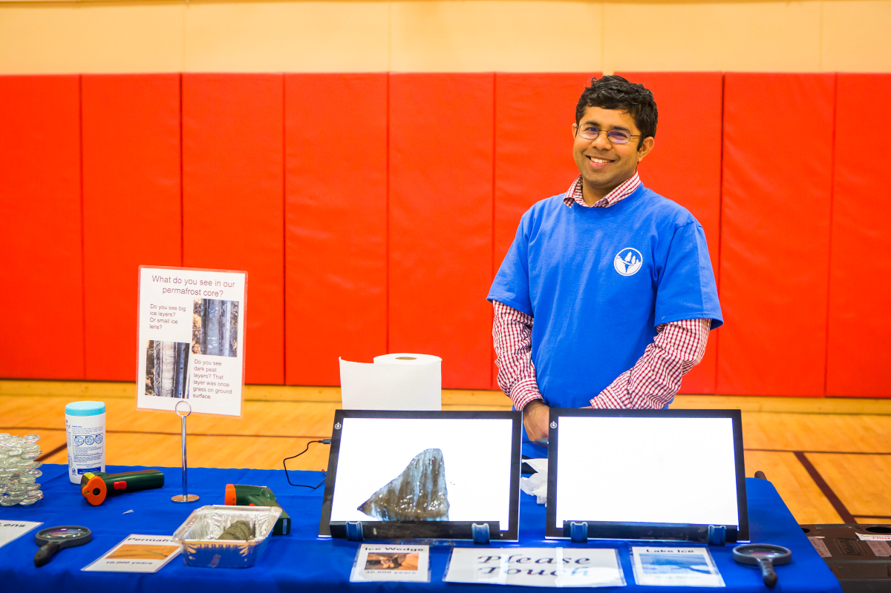

---
hide:
  - toc
  - navigation
---
<!--
CHECKLIST FOR THIS PAGE:
- [ ] Replace [YOUR NAME] with your full name (3 places)
- [ ] Replace [YOUR JOB TITLE] with your current or target role
- [ ] Replace [YOUR TAGLINE] with a short phrase describing your focus
- [ ] Rewrite the About Me paragraph with your own words
- [ ] Replace assets/images/profile.png with your actual photo (keep the filename or update it below)
- [ ] Replace assets/images/about.png with your own image (a field photo, map, or workspace shot)
- [ ] Edit the skill cards to match your actual skills (add, remove, or rename cards as needed)
- [ ] Update GitHub and LinkedIn links in the Connect section
- [ ] Add your CV PDF to docs/assets/ and update the filename in the Download CV button
-->

  
  <h1>Santosh Panda</h1>
  
<strong>Professor</strong>

  
<em>[Empowering Geospatial Education and Research]</em>

  
<em>[GIS | Remote Sensing | Data Science]</em>

---

## About Me

I received my undergraduate training in India and graduate training in both India and the United States. My research advances scientific understanding of climate-induced landscape change and related geohazards in Alaska — including large forest fires, thawing permafrost, and eroding riverbanks — with the goal of serving stakeholders and informing policy decisions that support sustainable solutions to emerging environmental problems. I draw on research techniques ranging from detailed field observations to regional-scale spatial modeling.
Notable contributions include the first high-resolution modeling of permafrost (perennially frozen ground) distribution across seven Alaska national park units, building community capacity to monitor permafrost in the Native villages of Telida and Nikolai, mapping Colville River bathymetry to support safe subsistence travel, and producing an updated 10 m wildfire fuel map of boreal Alaska. I currently lead research advancing remote sensing of forested ecosystems in Alaska to support forest health protection and management.
I teach GIS and remote sensing courses in the Department of Natural Resources and Environment at the University of Alaska Fairbanks (UAF).

  

---

[View My Projects :material-arrow-right:](projects/index.md){ .md-button .md-button--primary }
[Download CV :material-download:](assets/Santosh-CV.pdf){ .md-button }

---

## Skills

-   :material-layers:{ .lg .middle } **GIS & Remote Sensing**

    ---

    - ArcGIS Pro, Google Earth Engine
    - Multispectral and Hyperspectral image analysis
    - Cloud Native Geospatial (COG, STAC, Zarr)

-   :material-code-braces:{ .lg .middle } **Programming**

    ---

    - Python — GeoPandas, NumPy, Pandas, Matplotlib
    - R — sf, terra, ggplot2
    - JavaScript — Leaflet, MapLibre GL
    - SQL, PostgreSQL + PostGIS

-   :material-star-four-points:{ .lg .middle } **Machine Learning & GeoAI**

    ---

    - Supervised classification — Random Forest, XGBoost
    - Deep learning for image segmentation — U-Net, SAM
    - scikit-learn, PyTorch, TensorFlow
    - Object detection in satellite imagery

-   :material-earth:{ .lg .middle } **Web Mapping & Data**

    ---

    - Leaflet.js, Folium, MapLibre GL JS
    - Cloud storage — AWS S3, Google Cloud Storage
    - Data formats — GeoTIFF, GeoParquet, NetCDF
    - Streamlit for data-driven web apps

-   :material-database:{ .lg .middle } **Data & Cloud**

    ---

    - PostgreSQL + PostGIS
    - Cloud storage: AWS S3, Google Cloud Storage
    - Data formats: GeoJSON, GeoTIFF, NetCDF, Zarr, GeoParquet

-   :material-airplane:{ .lg .middle } **Drone / UAV Data Processing**

    - Mission planning and flight operations
    - Photogrammetry: Agisoft Metashape, OpenDroneMap
    - Point cloud processing: CloudCompare, PDAL

---

## Connect

[GitHub](https://github.com/skpanda1){ .md-button }
[LinkedIn](https://linkedin.com/in/skpanda@alaska.edu){ .md-button }
