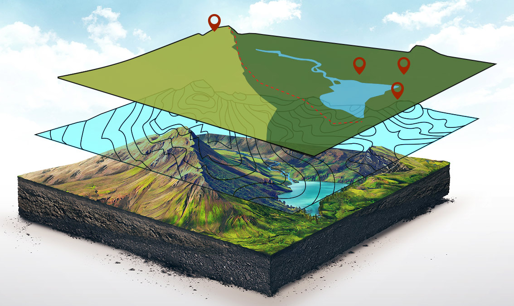

# GIS/Remote Sensing MOOC — AlaskaX

## Overview

Led the development and instruction of a series of massive open online courses (MOOCs) on GIS and remote sensing through AlaskaX, the University of Alaska Fairbanks' edX organization. Beginning with *Remote Sensing of Wildfires* in 2020, the series expanded in 2021 with three additional GIS courses forming a complete GIS Essentials certificate program, reaching over 50,000 learners across 190 countries.

**Study Area:** Global (online, asynchronous learners worldwide)  
**Duration:** 2020 – Present  
**Role:** Lead Instructor (with course development team)  
**Status:** Completed and live

---

## Methods & Tools

**Course Series**

- *Remote Sensing of Wildfires* (launched 2020)
- Three additional GIS courses (launched 2021), together forming the GIS Essentials certificate program

**Course Development Process**

1. Designed curriculum and learning objectives for each course, focused on practical, natural resource–oriented GIS and remote sensing applications
2. Produced video lectures, readings, and hands-on exercises using real Alaska-based datasets and case studies
3. Built assessments and interactive content within the edX Open edX platform
4. Iterated on course content based on learner feedback and engagement data after launch

**Tools Used**

| Tool | Purpose |
|------|---------|
| Open edX / AlaskaX platform | Course hosting, content delivery, and learner assessment |
| Esri ArcGIS Pro Desktop | GIS and remote sensing demonstrations and hands-on exercises across all four courses |
| Video production tools | Recording and editing lecture content |

---

## Key Findings

- Reached more than 50,000 learners across 190 countries, significantly extending the reach of UAF's GIS and remote sensing curriculum beyond the traditional classroom
- Successfully launched a four-course sequence culminating in a complete GIS Essentials certificate program
- Demonstrated strong global demand for accessible, applied GIS and remote sensing education centered on real-world environmental case studies

---

## Links

[View GIS Essentials Certificate Program](https://www.edx.org/certificates/professional-certificate/alaskax-geographic-information-systems-essentials?index=rv_product_summary&queryId=8425229e1f3012c5f29fee69e7a8998f&position=1){ .md-button }
[View Remote Sensing of Wildfires Course](https://www.edx.org/learn/environmental-science/university-of-alaska-fairbanks-remote-sensing-of-wildfires){ .md-button }
[View All Courses on edX](https://www.edx.org/search?q=alaskax%2C%20gis){ .md-button }